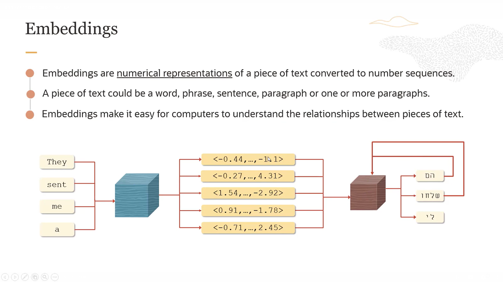
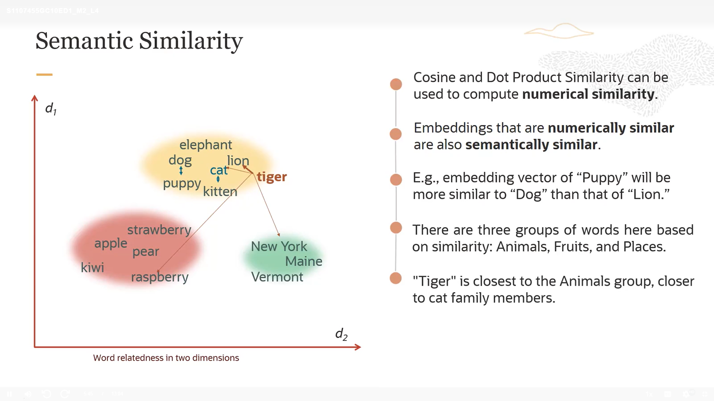
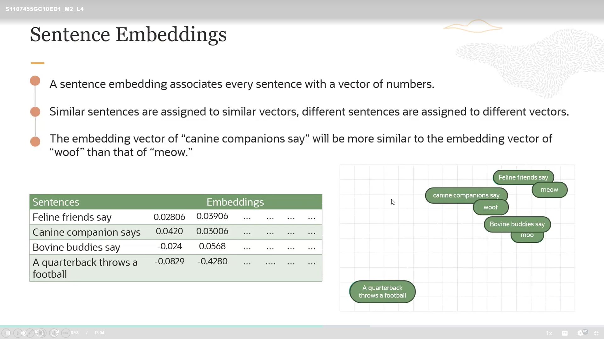
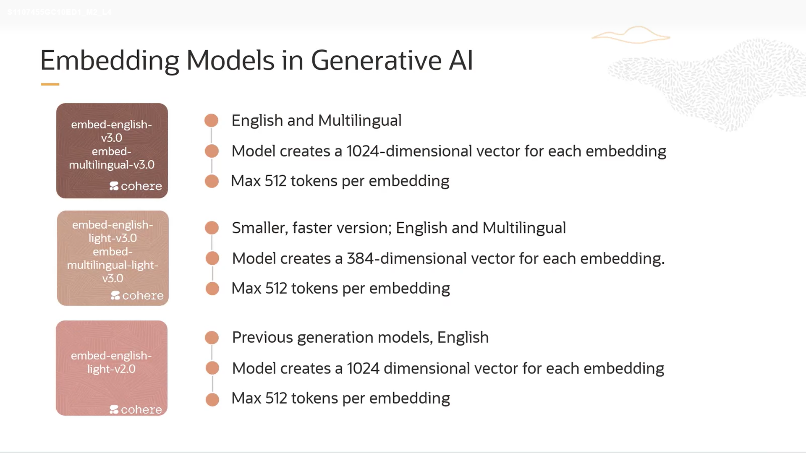
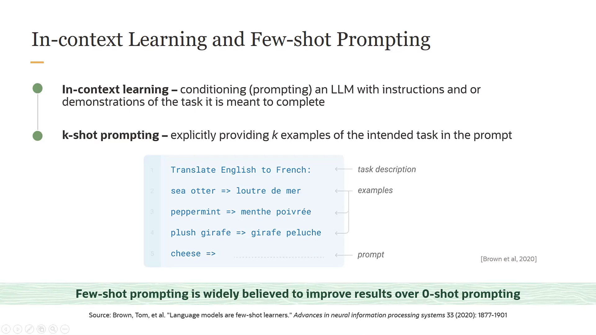
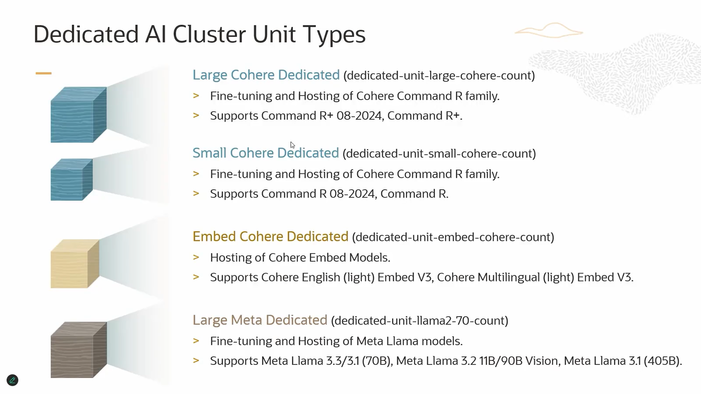

## What is coher in LLMs?
 Coher is usually an abbreviation or term that refers to a model's ability to generate coherent and connected text across multiple sentences or paragraphs.

 This means the model maintains context and links ideas logically without going off-topic or providing contradictory information.

 The term is often used in LLM research to measure the quality of generated text in terms of internal coherence.

 In other words, the more “coher” a model is, the more natural, logical, and smooth the generated text appears.

##  What is an Embedding Model in AI?

An embedding model is a type of AI model that converts any data (text, image, audio, etc.) into a numerical representation called “vectors.”

The idea: each text or item is transformed into a set of numbers that represent its meaning or features in a way the computer can understand.

## Why do we use it?

  * Text search: Find documents similar to a specific word or query.

  * Text classification: Quickly determine the type or topic of a text.

  * Content recommendation: Like “similar products” or “songs you might like.”

  * Data comparison: Measure similarity between texts or items by calculating the distance between their vectors.

Sure! Here's the English version of your text:

---

## Top-k Sampling

  * When the model chooses the next word, it picks from the **top k most probable words only.

  * Example: If there are 10 possible words and k=3 → it will choose from the top 3 words only.

  * Benefit: Reduces the chance of picking strange or inappropriate words, making the text more natural.

## Top-p Sampling (Nucleus Sampling)

  * Instead of a fixed number, the model chooses words whose **cumulative probability reaches p

  * Example: If p=0.9 → it selects words that together account for 90% of the total probability.

  * Benefit: More flexible than Top-k, because the choice depends on the actual probabilities of the words.

## What is an Embedding?

 Embedding in Artificial Intelligence (AI) is a method of transforming data (such as words, images, or even users) into numerical vectors, so that a computer can understand and process them.

Example:

   -If we have a word like "cat" or "dog", the computer doesn’t actually understand words.

   -Embedding converts the word into a sequence of numbers (a vector) in a mathematical space (vector space).

   -These numbers represent the meaning of the word, so that words with similar meanings are located close to each other in that space.

  For instance:

  * vector("cat") is very close to vector("dog").

  * But it is far from vector("car").

## Fact:
   Embedding first 🎯

     Any input (word, token, or item) is converted into a numerical vector.
     This step transforms the raw data (text, ID, etc.) into a form that the computer can work with.

   Encoder next 🧠

     The encoder takes these vectors (the embeddings) and passes them through layers of neural networks (like attention, RNN, CNN…).
     The goal is to extract a deeper representation that captures more meaning and context.

## What semantic Similarity?

  Similarity measures how close or alike two embeddings (vectors) are in the vector space.
  It tells us whether two items (words, images, users…) are semantically or contextually similar.

## How semantic Similarity works?

  Each item is represented as a vector (embedding).

  Closer vectors → higher similarity

  Farther vectors → lower similarity

## What Sentence Embedding ?

  Sentence Embedding is a method of converting an entire sentence into a single numerical vector that represents the meaning of the whole sentence, instead of converting each word individually.

  This vector captures the meaning and context of the sentence.

  It allows the system to compare sentences and determine which ones are similar to each other.

## Empadding Model in Generative AI

## What Context Learning?

 In-Context Learning does not require any special code or library.

 The main idea: the model infers the rule from the examples you provide in the text (prompt).

 All you need is a large language model (LLM) like GPT, BERT, or Sentence-BERT.

 You don’t need to write any training code; everything happens within the context of the question itself.

## Key Point

In In-Context Learning, the model does not know the pattern in advance the way a Supervised Model does.

You must provide examples in the prompt so that it can infer the pattern and apply it to new examples.

## What k_shot?

  k-shot prompting means that you give the model k examples in the prompt before asking it to solve a new example.

  k = the number of examples in the prompt

  * The goal: to help the model infer the pattern or rule from these examples

  * The more examples (k) you provide, the better the model understands the pattern and the lower the chance of error.

## What Few-Shot Fine-Tuning?

 is a method to customize a large language model (LLM) or any pre-trained model for a specific task, using only a small number of labeled examples.

 Unlike traditional training, it does not require millions of data points.

 The goal: to learn a new task or improve the model's performance on a specific task using a small amount of data.

## What costum model endpoint?

 Custom Model Endpoint is an interface (API) or access point that allows you to use a trained or customized model (Custom Model) directly online.

 In other words, after you train your model or perform fine-tuning, you can deploy it as a service and call it from any application or program.

 The model is then ready to answer queries or process data in real-time.

## Large Coher Detected

Meaning: The system detected a large text or document containing a logical and coherent sequence.

Commonly used to evaluate the consistency of long texts or articles.

## Small Coher Detected

Similar to Large Coher, but for small texts or short sentences.

Purpose: to check the consistency of meaning in short sentences or paragraphs.

## Embed Coher Detected

Here the system uses Embeddings (numeric vectors) to understand the text.

Measures the degree of similarity or coherence between parts of the text using vector representations.

Useful to determine if sentences or paragraphs are related to the same meaning.

## Large Meta Detected(Base model meta LLma)

"Meta" usually refers to metadata or characteristics of large texts.

Large Meta Detected → detecting important metadata or features in a large document.

Example: identifying text length, number of paragraphs, linguistic patterns, or organizational information in large texts.

| النقطة            | In-Context Learning                                                            | Few-Shot Fine-Tuning                                                                             |
| ----------------- | ------------------------------------------------------------------------------ | ------------------------------------------------------------------------------------------------ |
| **كيفية التعلم**  | النموذج **يستنتج النمط مباشرة من الأمثلة في الـ prompt** أثناء كل استدعاء.     | النموذج **يتم تعديل أوزانه جزئيًا** لتعلم المهمة من أمثلة قليلة.                                 |
| **تخزين المعرفة** | الأمثلة موجودة فقط في الـ prompt، النموذج **ما يحفظهاش** بعد انتهاء الاستدعاء. | الأمثلة تدخل في التدريب → النموذج **يحفظ النمط ويتذكره في المستقبل**.                            |
| **إضافة أمثلة**   | تضيف الأمثلة كل مرة **في الـ prompt** عند الاستخدام.                           | تضيف الأمثلة مرة واحدة في Fine-Tuning → النموذج **يتعلم النمط تلقائيًا ويطبق على بيانات جديدة**. |
| **الدقة**         | جيدة لكن محدودة لو الأمثلة قليلة جدًا أو معقدة.                                | أعلى دقة على المهمة نفسها بعد Fine-Tuning، خصوصًا مع بيانات متخصصة.                              |
