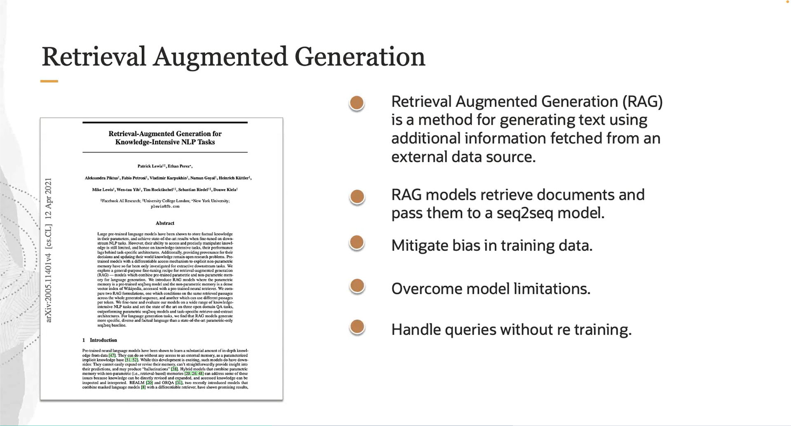
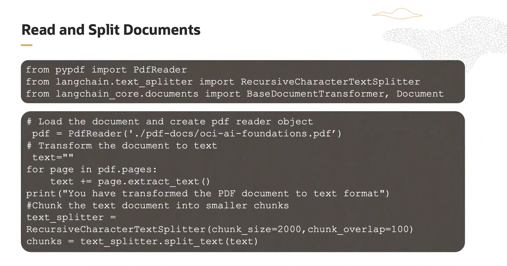
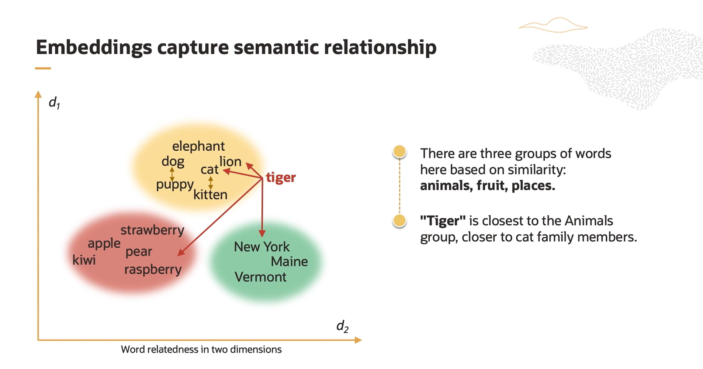
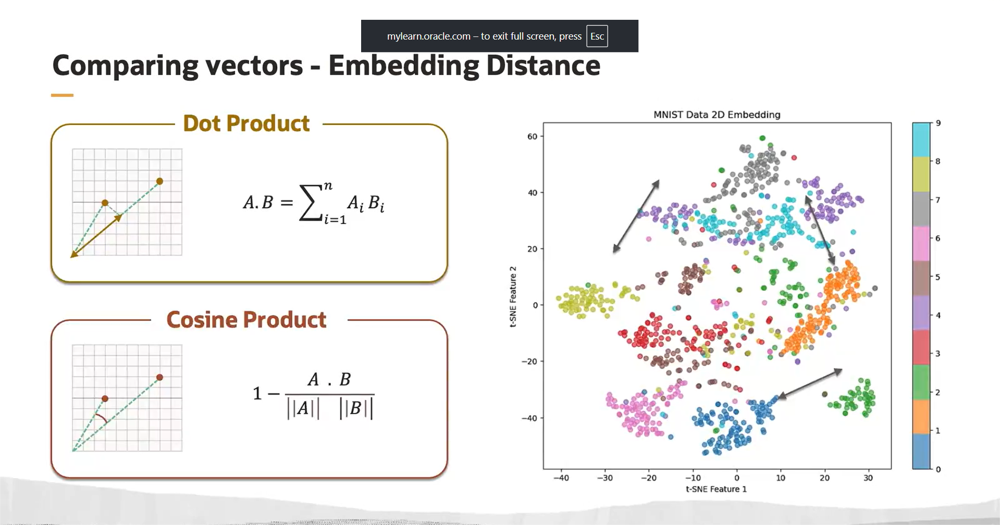

## LangChain Prompt 

   It is a structured text template that you give to the AI model to perform a specific task, with the ability to easily input different data, instead of writing all the instructions from scratch every time.

   * It is not an AI model itself.

   * It is not training for the model.

   * It is a smart way to organize commands and instructions for the model.

   * It allows you to reuse the same template with different data without rewriting everything.

## What is RAG(Retrieval-Augmented Generation) in AI?

Instead of the model relying only on the knowledge it was trained on, RAG allows it to search or retrieve information from external sources (like a database or documents) before generating an answer.

## Advantages of RAG:

   * Provides more accurate and up-to-date answers, because it doesn’t rely solely on the model’s pre-existing knowledge.

   * Very useful for specialized questions or rapidly changing information.

   * Allows combining retrieval and reasoning in a single step.

Read and Split Document

Literally, it means: "Read the document and split it."

In the context of AI and RAG:

Read Document:

  * The program or system opens the document (PDF, Word, text, etc.) and reads its content.

  * The goal is to extract all the text from the document.

Split Document:

  * After reading the text, it is divided into smaller chunks instead of handling the entire text at once.

  * Reason: Most AI models cannot process a very long document all at once.

  * Each small chunk is later stored in a database for retrieval (RAG).

## Semantic and embaddings

Semantic here means the "meaning" or "concept" that the sentence carries.

Embeddings are a numerical representation of the sentence in the form of a vector.

When we calculate the distance or similarity between the embedding of a new sentence and the stored embeddings (for example, for each category), we can determine which existing category the new sentence is close to.

In other words, the sentence belongs to or is classified into a certain group if its embedding is close to the stored embeddings of that group

## Comparing vector 
  1-Dot product 

  2-cosine product

Fact!

Exactly! Many modern chatbots, especially those relying on extensive knowledge or diverse content, are built using RAG (Retrieval-Augmented Generation).

RAG works by:

Retrieval: Pulling relevant information from a database, documents, or other external sources.

Augmented Generation: Using that retrieved information together with the model’s pre-trained knowledge to generate precise and useful responses.

This way, the chatbot can answer questions even if the information wasn’t part of its original training.

## Semantic search
Semantic Search is an advanced type of search that focuses on the meaning (semantics) of words rather than just exact keyword matching.

Instead of simply looking for the same keywords (like old Google search or plain SQL queries), semantic search tries to understand the context and intent behind the query to provide more accurate results.

 Example:

Keyword search: If you type "capital of Egypt", it will look for pages containing the exact words "capital" and "Egypt".

Semantic search: It understands that you’re asking for the capital city and returns "Cairo", even if the word "capital" isn’t explicitly written on the page.

## How semantic search works?

NLP (Natural Language Processing): to understand the meaning of words.

Embeddings: words and sentences are converted into numeric vectors, where similar meanings are placed close together in vector space.

Context understanding: it can distinguish between meanings (e.g., "Apple" as a fruit vs. "Apple" as a company).

 In short:

Keyword search = looks for the word itself.

Semantic search = looks for the meaning behind the word.