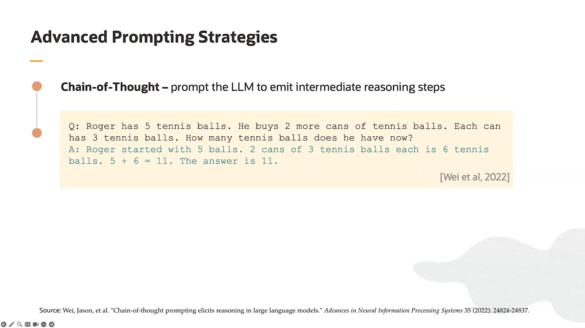
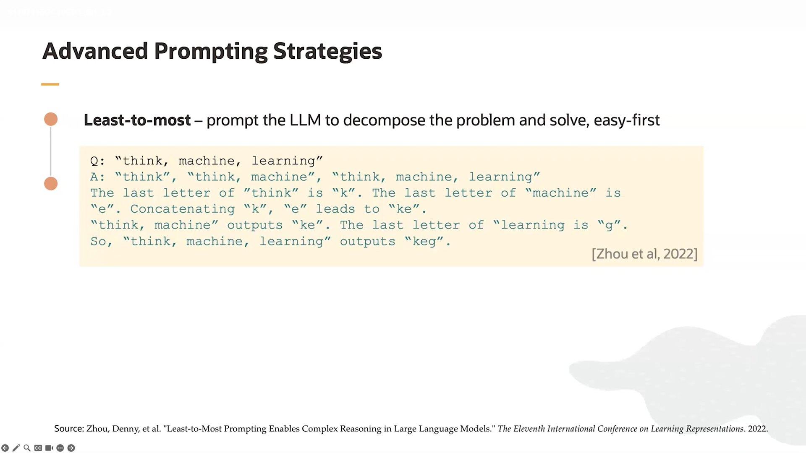
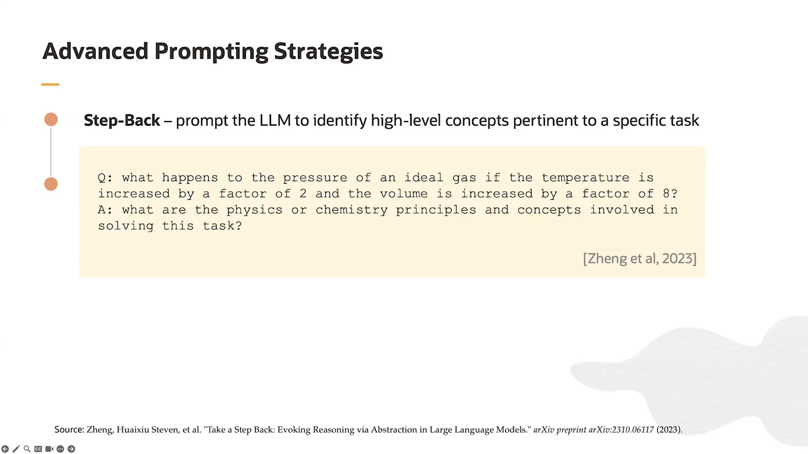

## What is an Encoder?
  * Function: Converts the original data (like text, image, or audio) into a compressed internal representation (latent representation).

  * Works like a feature extractor.

  * Output: A numerical vector that summarizes the meaning or important features of the data.

✅ Example (Text):
    Input: "I love cats"
    Encoder output: [0.21, -0.57, 0.89, ...] (a vector that represents the meaning).

  

## What is an Decoder?
A Decoder is a core component in AI models. Its role is to transform the latent representation coming from the Encoder into human-readable outputs.

## How Decoder works?

  * It receives the vector produced by the Encoder.

  * It starts generating the output gradually (step by step).

  * In text: it generates one word at a time (often one word per second), then uses that word together with the latent vector to generate the next word, and so on until the full sentence is produced.

  * In images: it generates pixels progressively until the complete image is formed.

  

## What the differance between Encoder only and Decoder only and Encoder + Decoder ?
   * If you have Encoder only → you just have an "information storage" without producing understandable output.

   * If you have Decoder only → you have a "generator" but it cannot work without some input information.

   * If you have Encoder + Decoder → you get a complete system: it understands + explains.

   

## What Chain of Thought (CoT)?

   * Chain of Thought (CoT) = the model (or a human) doesn’t jump straight to the final answer.

   * Instead → it writes out or “thinks” through a series of logical steps.

   * This makes the answer more accurate, especially for math, logic, programming, etc.

   

## What least to most prompting?

 Least to Most Prompting in AI means:

    Least prompting : a short, vague instruction.

    Most prompting : a very detailed, step-by-step instruction.

👉 The more details you give in your prompt, the better and clearer the AI’s response will be.

 

## What Step back prompting?

The model first takes a step back → to see the bigger picture.
Then it solves the problem as a whole or connects its parts together.

It’s useful when the task requires broad reasoning or a more holistic view rather than just step-by-step solving.

🔹 Like a teacher who says: “Wait… before we start, let’s look at the general idea and then go into the solution.”

 

## 🔑 Summary:

CoT = step-by-step logic.

Step-back = see the big picture first.

Least-to-Most = start simple, then add complexity.

## What is Prompt Injection?

   It’s a type of attack on AI models (LLMs).
   The idea is that an attacker writes a prompt in a malicious or tricky way to change the model’s behavior and make it do something it shouldn’t.

## Types of Prompt Injection:

Direct Prompt Injection

   * The attacker writes the malicious instructions directly in the prompt.

   * Indirect Prompt Injection

   * The malicious instructions are hidden in an external source (e.g., a webpage or PDF), and the model reads them by mistake and executes them.

## Why is Prompt Injection dangerous?

   * It can expose sensitive data (like API keys, passwords).

   * It can alter the system’s behavior (give wrong or harmful answers).

   * It can produce dangerous outputs (malicious code, harmful links).

  High temperature → more creative/diverse text

   * The model is less focused on the most probable word.

   * It can choose less likely words, producing unexpected or varied sentences.

Example:

   * Low temperature (0.2): The cat sat on the mat.

   * High temperature (1.5):

 The cat danced across the rooftop.

 The cat whispered secrets to the moon.

🔹 Summary: Higher temperature = more creativity, more variety.

## What Temperature Means in AI?

   * It’s a number you set to control the model’s randomness when generating text.

   * Lower number → the model focuses on the most probable words (more deterministic).

   * Higher number → the model becomes more creative and random, even less probable words may appear.

## What Meaning of Hallucination in LLMs?
the model outputs incorrect or fabricated information, even if the question is clear.

In other words, the model “makes up” answers or data that don’t exist or are wrong.

Examples:

   * Asking the model for a famous person’s birth date → it gives an incorrect date.

   * Asking for a book name → it invents a book that doesn’t exist.

## Why Hallucination in LLMs happens?

   * The model relies on probabilities of the next words.

   * If the context is unclear or the model is uncertain, it may choose an incorrect word or sentence → hallucination.

   * The more precise and factual the information requested, the more accurate the output; the more vague or general the request, the higher the chance of hallucination.
  

FACT:
  The main solution to reduce hallucination in large language models (LLMs) is to provide the model with accurate and complete context, so it has enough information before generating an answer.

## What REACT (in the context of Generative AI)?

   * Here, it’s not the web library React, but REACT = Reasoning + Acting.

   * It’s a framework or approach for generative AI where the model:

Reasoning → thinks and plans step by step.

Acting → takes actions, like using external tools or APIs.

Goal: Make the model not only generate text but also act intelligently to solve complex problems.

## What is Toolformer?

   * In the context of Generative AI:

   * It’s a generative AI model that learns automatically when to use external tools (e.g., search engines, calculators, translation tools) while generating content.

   * Example: If the model is asked a math question, instead of calculating it itself, it can use a calculator to get the correct answer.

## What Bootstrapped Reasoning?

   * A method to teach generative AI to solve complex problems step by step by reviewing simpler solutions.

   * Idea: The model starts by solving simple problems → uses those solutions as examples → improves itself to solve harder problems without direct human guidance.

   * Goal: Increase the model’s accuracy in reasoning and logical thinking.

