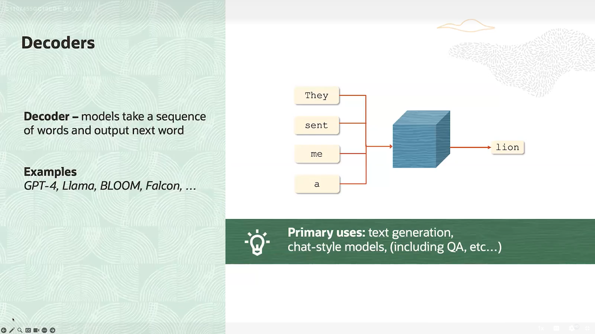

## What is an Encoder?
  * Function: Converts the original data (like text, image, or audio) into a compressed internal representation (latent representation).

  * Works like a feature extractor.

  * Output: A numerical vector that summarizes the meaning or important features of the data.

✅ Example (Text):
    Input: "I love cats"
    Encoder output: [0.21, -0.57, 0.89, ...] (a vector that represents the meaning).

  

## What is an Decoder?
A Decoder is a core component in AI models. Its role is to transform the latent representation coming from the Encoder into human-readable outputs.

## How Decoder works?

  * It receives the vector produced by the Encoder.

  * It starts generating the output gradually (step by step).

  * In text: it generates one word at a time (often one word per second), then uses that word together with the latent vector to generate the next word, and so on until the full sentence is produced.

  * In images: it generates pixels progressively until the complete image is formed.

  

## What the differance between Encoder only and Decoder only and Encoder + Decoder ?
   * If you have Encoder only → you just have an "information storage" without producing understandable output.

   * If you have Decoder only → you have a "generator" but it cannot work without some input information.

   * If you have Encoder + Decoder → you get a complete system: it understands + explains.

   

## What Chain of Thought (CoT)?

   * Chain of Thought (CoT) = the model (or a human) doesn’t jump straight to the final answer.

   * Instead → it writes out or “thinks” through a series of logical steps.

   * This makes the answer more accurate, especially for math, logic, programming, etc.

🔹 Example:

    * Question: You have 2 apples + 3 apples, how many in total?

    * Without CoT: Answer = 5.

    * With CoT: First I have 2 apples, then I add 3 apples, total = 5.

    * So simply: CoT = step-by-step reasoning.

    
  